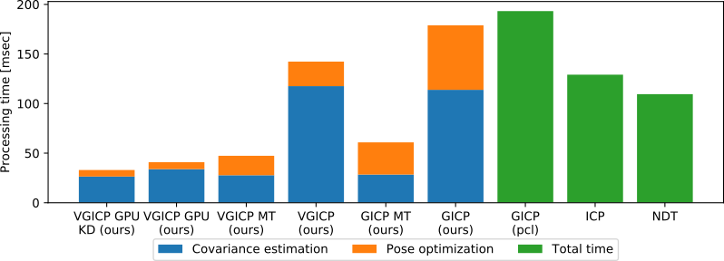

# fast_gicp

This is a forked version of fast_gicp that allows for 2D registration - used for 2D LiDAR registration.

This package is a collection of GICP-based fast point cloud registration algorithms. It constains a multi-threaded GICP as well as multi-thread and GPU implementations of our voxelized GICP (VGICP) algorithm. All the implemented algorithms have the PCL registration interface so that they can be used as an inplace replacement for GICP in PCL.

- FastGICP: multi-threaded GICP algorithm (**\~40FPS**)
- FastGICPSingleThread: GICP algorithm optimized for single-threading (**\~15FPS**)
- FastVGICP: multi-threaded and voxelized GICP algorithm (**\~70FPS**)
- FastVGICPCuda: CUDA-accelerated voxelized GICP algorithm (**\~120FPS**)
- NDTCuda: CUDA-accelerated D2D NDT algorithm (**\~500FPS**)


[](https://github.com/SMRT-AIST/fast_gicp/actions/workflows/build.yml) on melodic & noetic

## Installation

### Dependencies
- PCL
- Eigen
- OpenMP
- CUDA (optional)
- [Sophus](https://github.com/strasdat/Sophus)
- [nvbio](https://github.com/NVlabs/nvbio)

We have tested this package on Ubuntu 18.04/20.04 and CUDA 11.1.

### CUDA

To enable the CUDA-powered implementations, set ```BUILD_VGICP_CUDA``` cmake option to ```ON```.

### ROS
```bash
cd ~/catkin_ws/src
git clone https://github.com/SMRT-AIST/fast_gicp --recursive
cd .. && catkin_make -DCMAKE_BUILD_TYPE=Release
# enable cuda-based implementations
# cd .. && catkin_make -DCMAKE_BUILD_TYPE=Release -DBUILD_VGICP_CUDA=ON
```

### Non-ROS
```bash
git clone https://github.com/SMRT-AIST/fast_gicp --recursive
mkdir fast_gicp/build && cd fast_gicp/build
cmake .. -DCMAKE_BUILD_TYPE=Release
# enable cuda-based implementations
# cmake .. -DCMAKE_BUILD_TYPE=Release -DBUILD_VGICP_CUDA=ON
make -j8
```

### Python bindings
```bash
cd fast_gicp
python3 setup.py install --user
```
Note: If you are on a catkin-enabled environment and the installation doesn't work well, comment out ```find_package(catkin)``` in CMakeLists.txt and run the above installation command again.


```python
import pygicp

target = # Nx3 numpy array
source = # Mx3 numpy array

# 1. function interface
matrix = pygicp.align_points(target, source)

# optional arguments
# initial_guess               : Initial guess of the relative pose (4x4 matrix)
# method                      : GICP, VGICP, VGICP_CUDA, or NDT_CUDA
# downsample_resolution       : Downsampling resolution (used only if positive)
# k_correspondences           : Number of points used for covariance estimation
# max_correspondence_distance : Maximum distance for corresponding point search
# voxel_resolution            : Resolution of voxel-based algorithms
# neighbor_search_method      : DIRECT1, DIRECT7, DIRECT27, or DIRECT_RADIUS
# neighbor_search_radius      : Neighbor voxel search radius (for GPU-based methods)
# num_threads                 : Number of threads


# 2. class interface
# you may want to downsample the input clouds before registration
target = pygicp.downsample(target, 0.25)
source = pygicp.downsample(source, 0.25)

# pygicp.FastGICP has more or less the same interfaces as the C++ version
gicp = pygicp.FastGICP()
gicp.set_input_target(target)
gicp.set_input_source(source)
matrix = gicp.align()

# optional
gicp.set_num_threads(4)
gicp.set_max_correspondence_distance(1.0)
gicp.get_final_transformation()
gicp.get_final_hessian()
```

## Benchmark
CPU:Core i9-9900K GPU:GeForce RTX2080Ti

```bash
roscd fast_gicp/data
rosrun fast_gicp gicp_align 251370668.pcd 251371071.pcd
```

```
target:17249[pts] source:17518[pts]
--- pcl_gicp ---
single:127.508[msec] 100times:12549.4[msec] fitness_score:0.204892
--- pcl_ndt ---
single:53.5904[msec] 100times:5467.16[msec] fitness_score:0.229616
--- fgicp_st ---
single:111.324[msec] 100times:10662.7[msec] 100times_reuse:6794.59[msec] fitness_score:0.204379
--- fgicp_mt ---
single:20.1602[msec] 100times:1585[msec] 100times_reuse:1017.74[msec] fitness_score:0.204412
--- vgicp_st ---
single:112.001[msec] 100times:7959.9[msec] 100times_reuse:4408.22[msec] fitness_score:0.204067
--- vgicp_mt ---
single:18.1106[msec] 100times:1381[msec] 100times_reuse:806.53[msec] fitness_score:0.204067
--- vgicp_cuda (parallel_kdtree) ---
single:15.9587[msec] 100times:1451.85[msec] 100times_reuse:695.48[msec] fitness_score:0.204061
--- vgicp_cuda (gpu_bruteforce) ---
single:53.9113[msec] 100times:3463.5[msec] 100times_reuse:1703.41[msec] fitness_score:0.204049
--- vgicp_cuda (gpu_rbf_kernel) ---
single:5.91508[msec] 100times:590.725[msec] 100times_reuse:226.787[msec] fitness_score:0.20557
```

See [src/align.cpp](https://github.com/SMRT-AIST/fast_gicp/blob/master/src/align.cpp) for the detailed usage.

## Test on KITTI

### C++

```bash
# Perform frame-by-frame registration
rosrun fast_gicp gicp_kitti /your/kitti/path/sequences/00/velodyne
```


### Python

```bash
cd fast_gicp/src
python3 kitti.py /your/kitti/path/sequences/00/velodyne
```

## Related packages
- [ndt_omp](https://github.com/koide3/ndt_omp)
- [fast_gicp](https://github.com/SMRT-AIST/fast_gicp)


## Papers
- Kenji Koide, Masashi Yokozuka, Shuji Oishi, and Atsuhiko Banno, Voxelized GICP for fast and accurate 3D point cloud registration, ICRA2021 [[link]](https://easychair.org/publications/preprint/ftvV)

## Contact
Kenji Koide, k.koide@aist.go.jp

Human-Centered Mobility Research Center, National Institute of Advanced Industrial Science and Technology, Japan  [\[URL\]](https://unit.aist.go.jp/rirc/en/team/smart_mobility.html)
